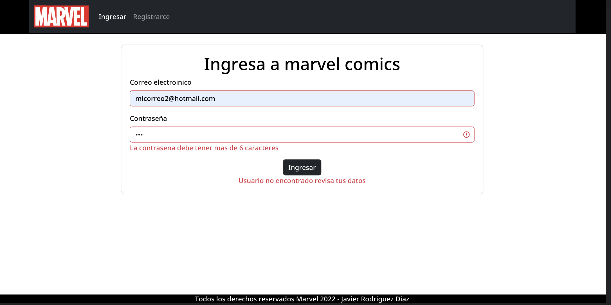
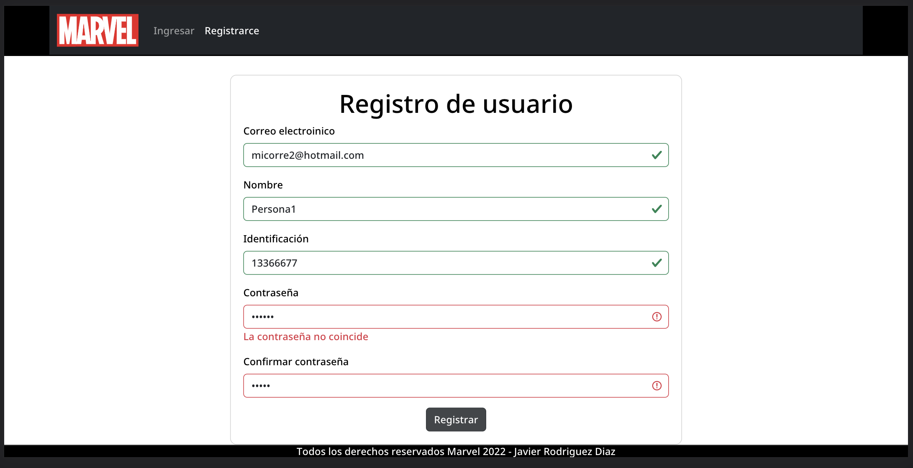
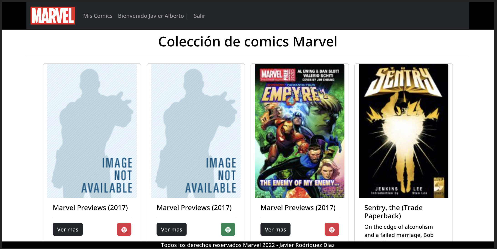
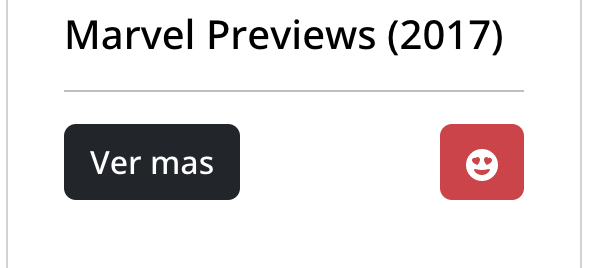
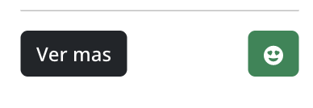
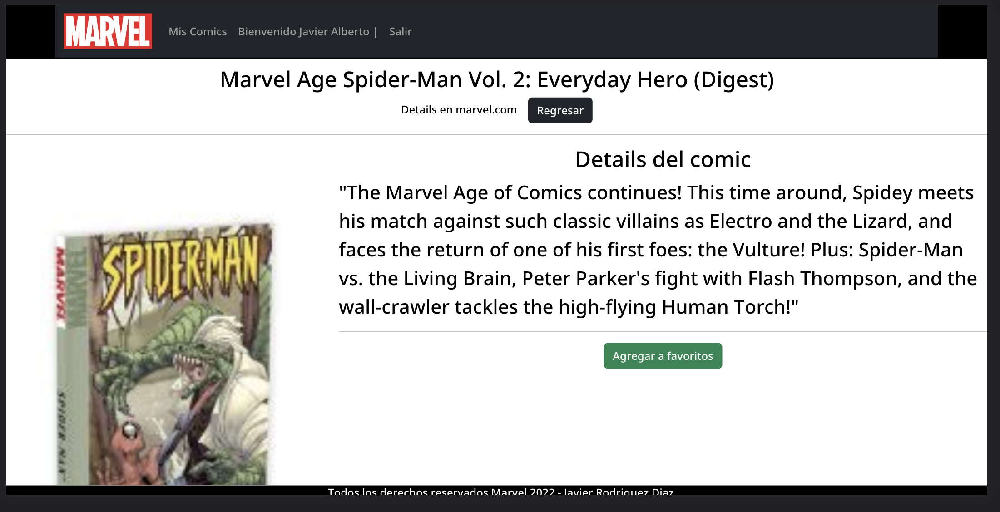
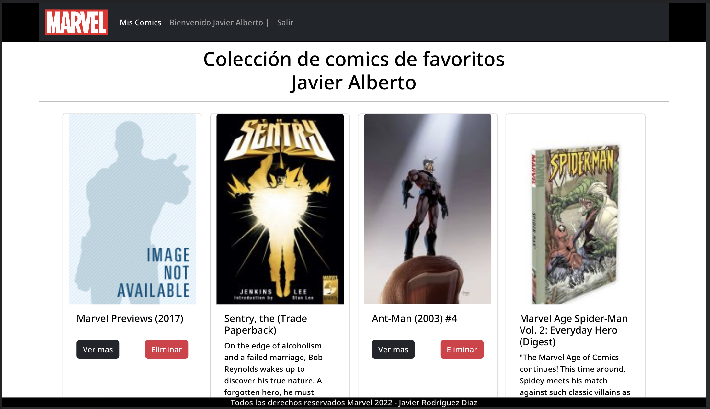

# Marvel mis comics
Proyecto inicializado con [Create React App](https://github.com/facebook/create-react-app).

Se desarrolló una plataforma de consumo del API de Marvel para presentar los primeros 20 comics y generar un listado de favoritos con su respectivo detalle, persistiendo los datos en el proyecto SPA

# Objetivo
Demostrar conocimientos  referentes al desarrollo web, uso de estilos, maquetación y uso de React JS

## Tecnologías usadas
- HTML 5
- CSS 3
- Boostrap
- React JS
- JavaScript
- JSX

## Características
-   Arquitectura compositiva

-  Uso de Context API
-  registro de usuario con validación de datos usando componentes controlados
-  uso de localStorage para persistencia de los datos
-  Carga mediante localStorage y lógica para persistir estados y datos
-  Uso de arquitectura compositiva
- Independencia de listados para cada usuario

## Pruebas
### Para ejecutar el proyecto se debe realizar la descarga de los archivos y seguir los siguientes pasos:

-   Realizar clone del proyecto
-   Ejecutar en terminal "npm install" para instalar las dependencias
-   Ejecutar en terminal "npm start"
-   realizar el registro de usuario

# Manual de instalación y despliegue

- Revisar los componentes de Routing y configurar Lazyload y optimización para las rutas de los componentes de Página

- Realizar el comando ¨npm run build¨ para generarl los archivos optimizados del aplicativo

- Configurar un servidor en nginx o apache o alguno similar, no es necesario tener tecnologías de lado del servidor como php o dijano

- Se deben configurar los registros “A CNAME” para los nombres de dominio a utilizar

- Se debe subir los archivos contenidos en la carpeta configurada del servidor web

# Manual de usuario

### aquí encontrarás los pasos para usar la aplicación

## Login

- Ingresa los datos correctos para ingresar al sistema, si no tienes un usuario registrado ingresa a la opción "Registrarce".

## Registro

- Ingresa tus datos personales para registrarte al sistema, estos, deben ser datos válidos y además no debe haber un usuario con el mismo correo, en caso contrario el sistema no te permitirá registrar.

## Listado

- una vez ingreses el sistema mostrará los 20 primeros comics de Marvel, se puede agregar a favoritos si se desea directamente desde el listado o con el detalle del comic.

## Detalle

- Al dar clic en ver más, se observará una página completa con solo el comic seleccionado, también se puede agregar a favoritos desde esta sección dando clic en agregar favoritos, si está en color verde este ya está en el listado de favoritos, si está en color rojo este no está en el listado.

## Favoritos

- Al dar clic en mis comics, se encontrarán los comics agregados mediante el botón cara feliz en el listado general, o en detalle de cada comic con la acción "agregar a favoritos", se puede ver detalle y puedes quitarlos del listado con la acción de eliminar de cada carta de comic.

# Contacto

(www.linkedin.com/in/faroing)

